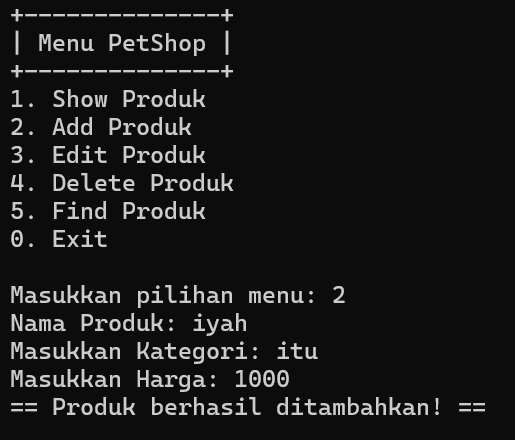

# LP1DPBO2025C1

Alifa Salsabila dengan NIM 2308138 mengerjakan soal Latihan Modul
dalam mata kuliah DPBO untuk keberkahanNya maka saya tidak melakukan
kecurangan seperti yang telah dispesifikasikan. Aamiin

## Detail Pemrogramana
Program ini adalah sebuah aplikasi manajemen produk Petshop yang memungkinkan pengguna untuk mengelola daftar produk. Pengguna dapat menampilkan, menambah, mengedit, dan menghapus produk. Setiap produk memiliki atribut:
- ID
- Nama Produk
- Kategori
- Harga

## Fitur Utama
|Input| Deskripsi |
|-----|-----------|
|  1  | Menampilkan daftar produk dengan ID, nama, kategori, harga, dan foto. |
|  2  | Pengguna dapat menambahkan produk baru beserta foto. |
|  3  | Mengubah informasi produk, termasuk mengganti foto. |
|  4  | Menghapus produk dari daftar dan menghapus file foto terkait. |

